# neuronbot2_lecture

Packages for ROS 2 Autonomous Robot lecture.

## Day 1
---

### Robot Description

* package build

```bash
cd ~/<your-workspace>
colcon build --symlink-install --packages-select neuronbot2_lecture
source ./install/setup.bash
```

* example1 - neuronbot2 description 

```
ros2 launch neuronbot2_lecture neuronbot_description.launch.py
```

<p align="center">
    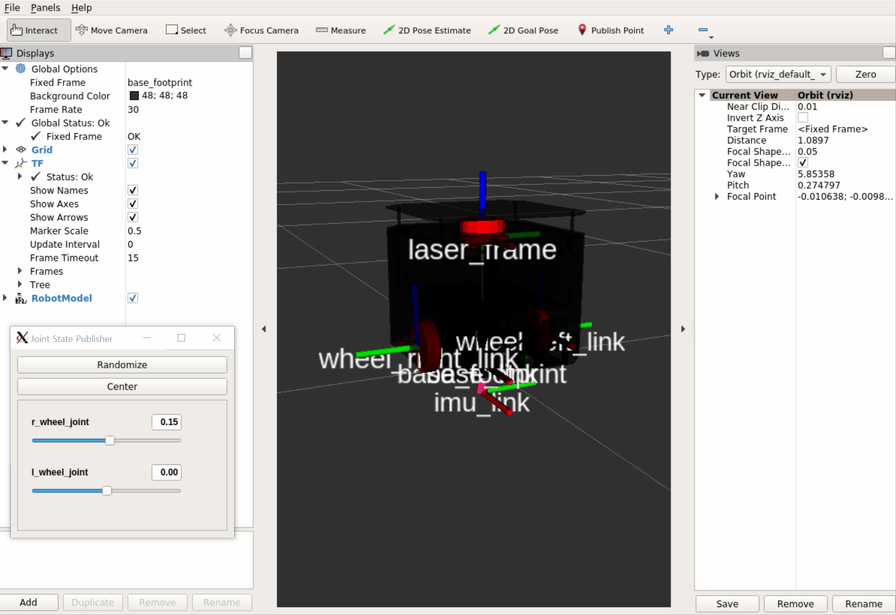
</p>

* example2 - spot description

<p align="center">
    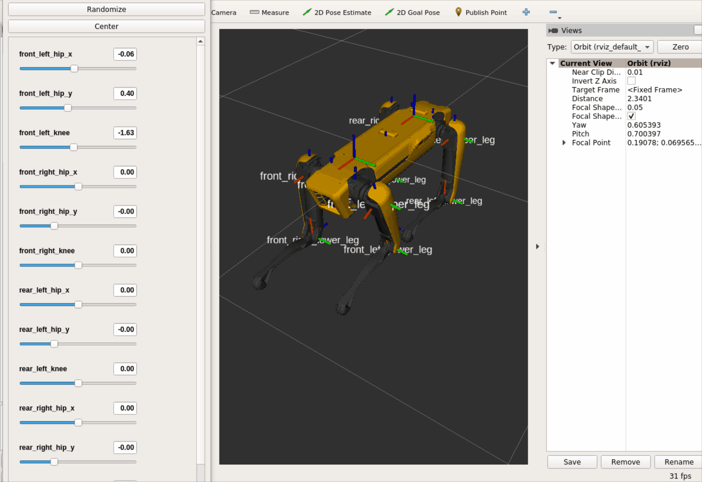
</p>

## Day 2
---

### Gazebo with Robot

* package build

```bash
cd ~/<your-workspace>
colcon build --symlink-install --packages-select fusionbot_gazebo
source ./install/setup.bash

colcon build --symlink-install --packages-select fusionbot_description
source ./install/setup.bash
```

* example1 - Add various gazebo models from osrf github

<p>
    <p align="center">
        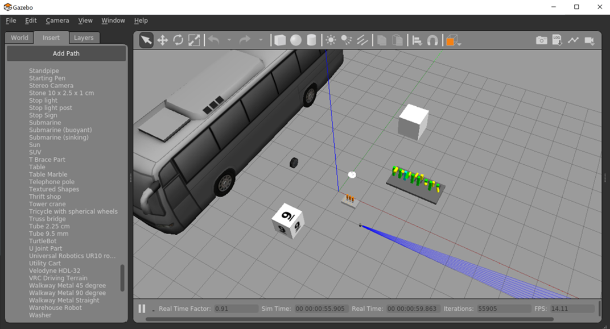
    </p>
</p>

```bash
cd ~/.gazebo/models
git clone https://github.com/osrf/gazebo_models.git

cd gazebo_models
rm -rf ground_plane
rm -rf sun
mv * ../
```

* example2 - Fusion360 model to Gazebo

<p>
    <p align="center">
        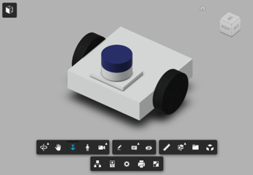
        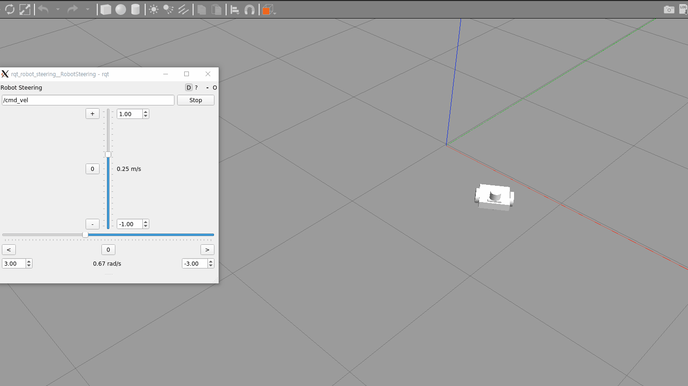
    </p>
</p>

prepare `fusion2urdf` scripts for conversion.

```bash
git clone https://github.com/syuntoku14/fusion2urdf.git 

cd fusion2urdf
cp -r ./URDF_Exporter /mnt/c/Users/<user-name>/AppData/Roaming/Autodesk/Autodesk\ Fusion\ 360/API/Scripts/
```

| referenced from [Jerin Peter](https://www.youtube.com/channel/UCBZJJmnJtioJtXZqPKJ3CfQ)'s video : https://www.youtube.com/watch?v=cQh0gNfb6ro

Play with fusionbot and Lidar sensors

<p>
    <p align="center">
        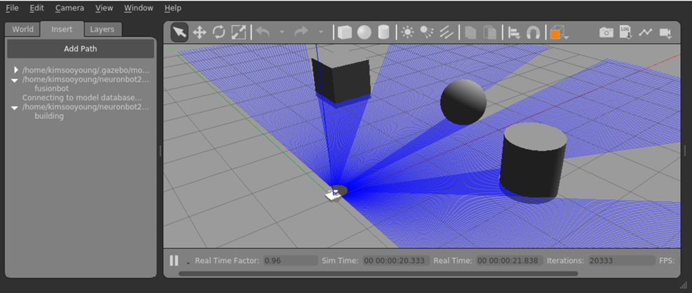
    </p>
</p>

```
ros2 launch fusionbot_description fusionbot_gazebo.launch.py
ros2 run teleop_twist_keyboard teleop_twist_keyboard
```

* example3 - Gazebo Building Editor

<p>
    <p align="center">
        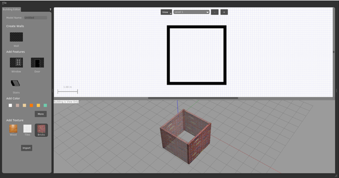
        
    </p>
</p>

```
ros2 launch fusionbot_gazebo my_world.launch.py
ros2 run teleop_twist_keyboard teleop_twist_keyboard
```

* example4 - Moving Gazebo Objects

<p>
    <p align="center">
        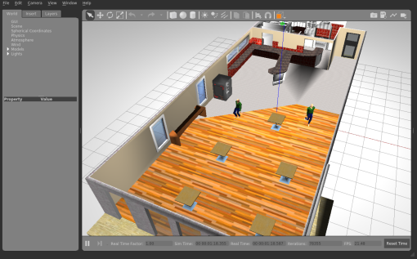
    </p>
</p>

```
ros2 launch fusionbot_gazebo caffee_world.launch.py
```

<p>
    <p align="center">
        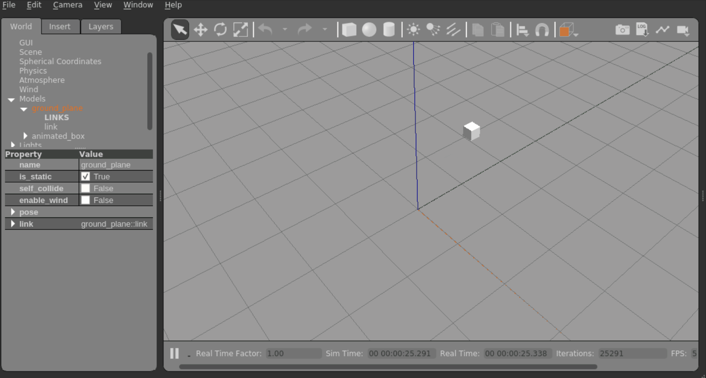
    </p>
</p>

```
ros2 launch fusionbot_gazebo moving_box.launch.py
```

<p>
    <p align="center">
        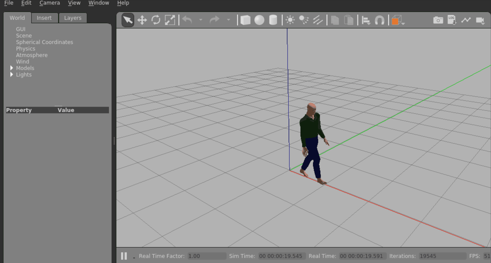
    </p>
</p>

```
ros2 launch fusionbot_gazebo walk.launch.py
```

<p>
    <p align="center">
        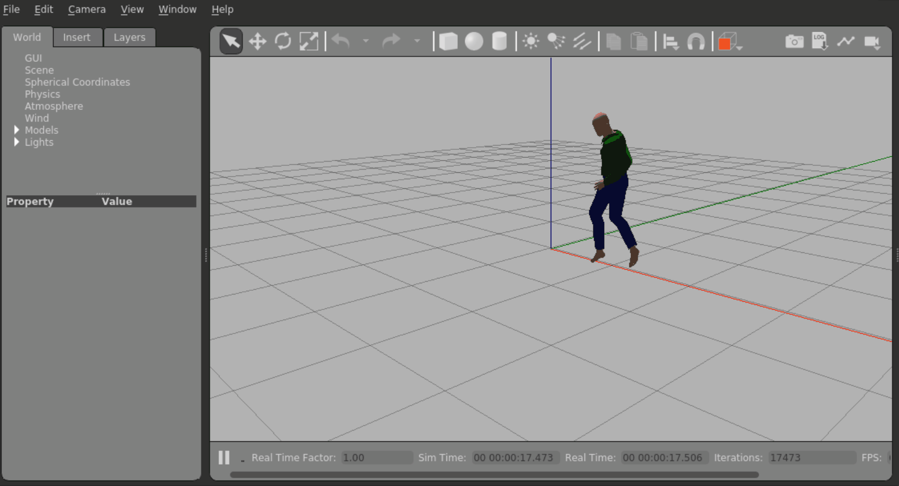
    </p>
</p>

```
ros2 launch fusionbot_gazebo moon_walk.launch.py
```

<p>
    <p align="center">
        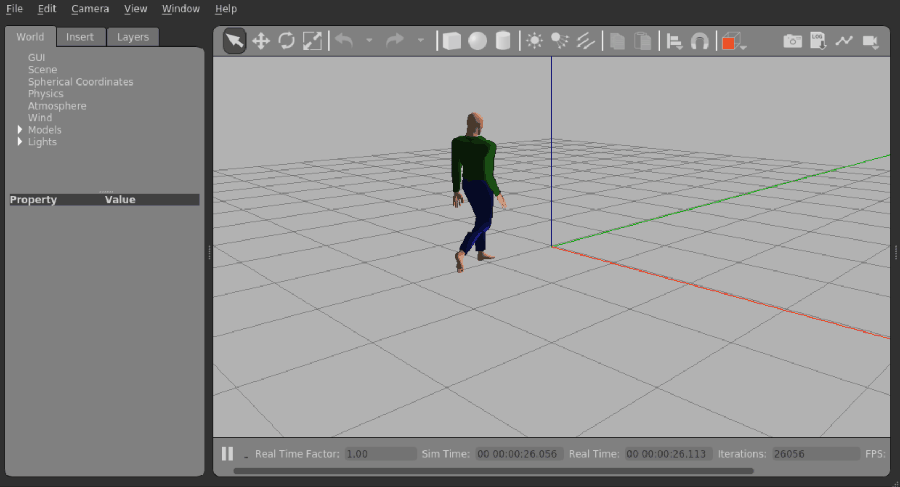
    </p>
</p>

```
ros2 launch fusionbot_gazebo synced_actor.launch.py
```

* Amazon [small_warehouse_world](https://github.com/aws-robotics/aws-robomaker-small-warehouse-world)

<p>
    <p align="center">
        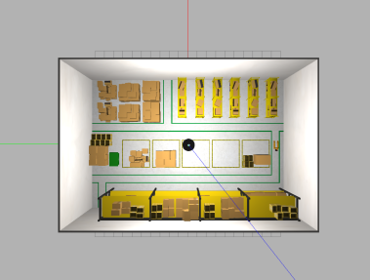
    </p>
</p>

```bash
cd ~/<your-ws>/src/
git clone -b ros2 https://github.com/aws-robotics/aws-robomaker-small-warehouse-world.git
cd ~/<your-ws>

colcon build --symlink-install --packages-select aws_robomaker_small_warehouse_world && roseloq
source /usr/share/gazebo/setup.sh

# launch
ros2 launch fusionbot_gazebo aws_factory.launch.py
```

* Fusionbot in Amazon small warehouse

<p>
    <p align="center">
        
    </p>
</p>

```
ros2 launch fusionbot_gazebo fusionbot_aws_factory.launch.py
ros2 run teleop_twist_keyboard teleop_twist_keyboard
```

* MIT [RaceCar world](https://github.com/mit-racecar/racecar_gazebo)

<p>
    <p align="center">
        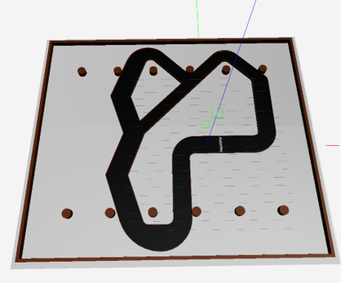
    </p>
</p>

```
ros2 launch fusionbot_gazebo racecourse.launch.py
```

### Odometry and Sensor Fusion

* various odometry

Lidar Odom

<p>
    <p align="center">
        
        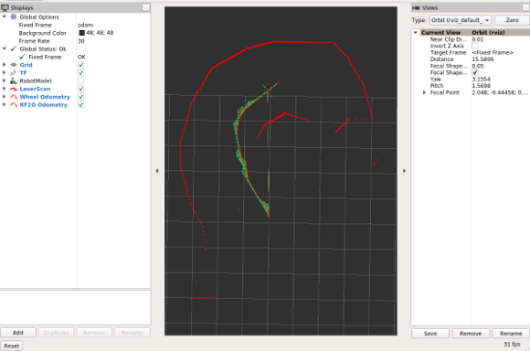
    </p>
</p>

```bash
# Package build
cbp rf2o_laser_odometry && roseloq && cbp neuronbot2_lecture && roseloq 

# launch in each terminal
ros2 launch neuronbot2_gazebo neuronbot2_world.launch.py world_model:=mememan_world.model
ros2 launch neuronbot2_lecture laser_odom.launch.py
ros2 run teleop_twist_keyboard teleop_twist_keyboard
```

* robot_localization

build packages

```bash
cd ~/<your-ws>/src
git clone -b eloquent-devel https://github.com/Adlink-ROS/robot_localization.git
cd ~/<your-ws>/

colcon build --symlink-install --packages-select robot_localization
# long waiting time
source ./install/setup.bash

colcon build --symlink-install --packages-select neuronbot2_sensor_fusion
source ./install/setup.bash
```

* Filtered Odom

<p>
    <p align="center">
        
        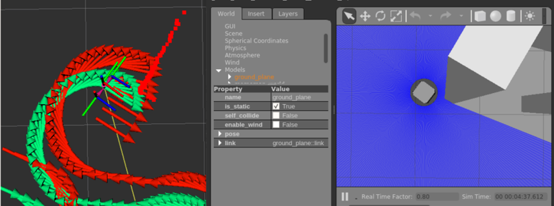
    </p>
</p>

```bash
# launch in each terminals
ros2 launch neuronbot2_sensor_fusion neuronbot2_world.launch.py
ros2 launch neuronbot2_sensor_fusion robot_localization.launch.py
ros2 run teleop_twist_keyboard teleop_twist_keyboard
```

* Comparison with Ground Truth Odom

<p align="center">
    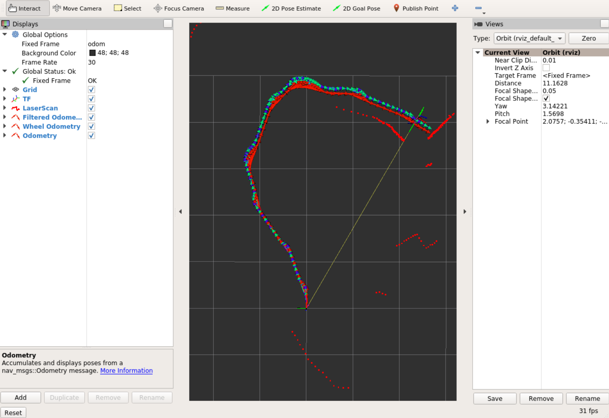
</p>

```bash
# launch in each terminals
ros2 launch neuronbot2_sensor_fusion neuronbot2_world.launch.py
ros2 launch neuronbot2_sensor_fusion gt_odom_pub.launch.py
ros2 launch neuronbot2_sensor_fusion robot_localization.launch.py
ros2 run teleop_twist_keyboard teleop_twist_keyboard
rqt
```

If there's an error during `gt_odom_pub.launch.py`

```bash
cd ~/neuronbot2_eloquent_ws/src/neuronbot2/neuronbot2_lecture/neuronbot2_sensor_fusion/scripts
chmod +x *

sudo apt install dos2unix
dos2unix gt_odom_node.py

cd ~/neuronbot2_eloquent_ws
cbp neuronbot2_sensor_fusion && roseloq
```

* Real Robot odometry and Sensor Fusion

<p>
    <p align="center">
        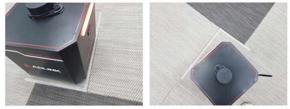
        
    </p>
</p>

You can replay my log through `rosbag`, which located in rosbag file

* laser_odom_log_1
* laser_odom_log_2
* laser_odom_log_3
* neuronbot2_20220117_03

rosbag replay and visualization with rviz

<p>
    <p align="center">
        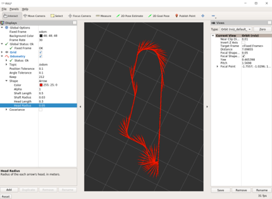
        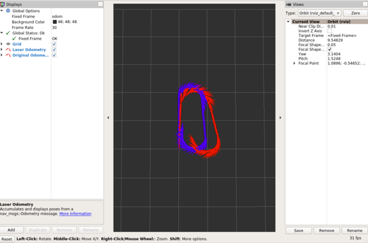
        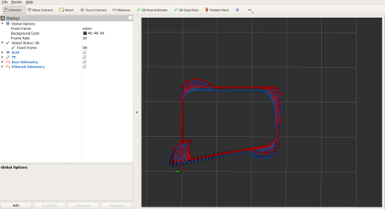
    </p>
</p>

```bash
# Install packages
sudo apt install ros-eloquent-rosbag2* -y
sudo apt install ros-eloquent-ros2bag -y 

ros2 bag play <your-prefer-rosbag>

# For laser odom viz
ros2 launch neuronbot2_lecture rosbag_odom_rviz.launch.py
# For various odom comparison
ros2 launch neuronbot2_sensor_fusion rosbag_odom_rviz.launch.py
```

## Day 3
---

### Mapping 

Install SLAM ROS Packages

```
sudo apt install ros-eloquent-slam-toolbox -y
sudo apt install ros-eloquent-cartographer* -y
```

* Run SLAM

```bash
# Run Gazebo Env
ros2 launch neuronbot2_gazebo neuronbot2_world.launch.py world_model:=mememan_world.model

# Lauch your prefer slam package
ros2 launch neuronbot2_slam gmapping_launch.py open_rviz:=true
ros2 launch neuronbot2_slam slam_toolbox_launch.py open_rviz:=true
ros2 launch neuronbot2_slam cartographer_launch.py open_rviz:=true

# Robot control - teleop for SLAM
ros2 run teleop_twist_keyboard teleop_twist_keyboard

# Save map
ros2 run nav2_map_server map_saver -f <map_dir>/<map_name>
```

Edit your map with [GIMP](https://www.gimp.org/) after SLAM

<p>
    <p align="center">
        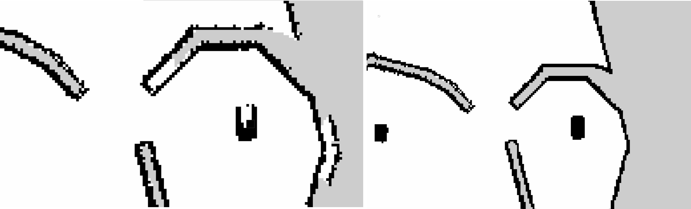
    </p>
</p>

* Real Robot SLAM - We used Adlink's [neuronbot2](https://github.com/Adlink-ROS/neuronbot2)

```bash
# Wake robot up, Sensor up ETC...
ros2 launch neuronbot2_bringup bringup_launch.py use_ekf:=true

# launch SLAM 
ros2 launch neuronbot2_slam slam_toolbox_launch.py open_rviz:=true

# Robot control - teleop for SLAM
ros2 run teleop_twist_keyboard teleop_twist_keyboard
```

<p>
    <p align="center">
        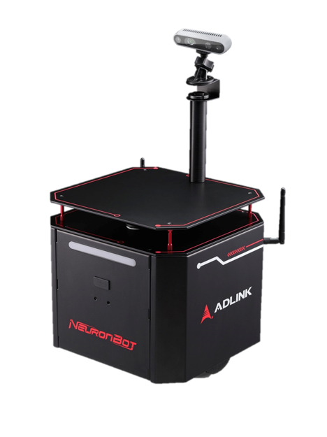
        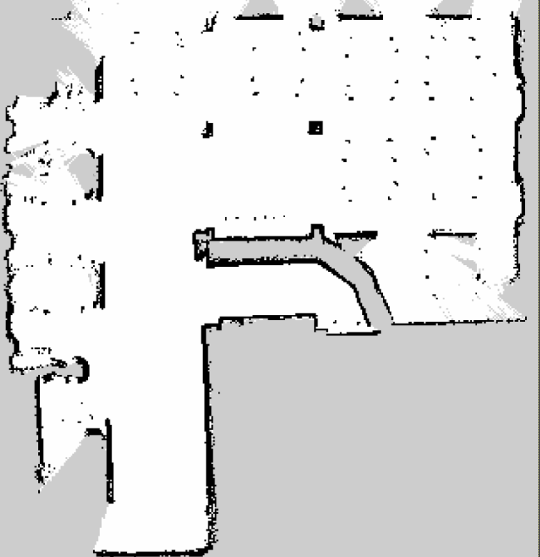
    </p>
</p>

## Day 4
---

### Localization

* Neuronbot2 Localization

```bash
# Gazebo Env launch
ros2 launch neuronbot2_gazebo neuronbot2_world.launch.py world_model:=mememan_world.model

# AMCL localization launch
ros2 launch neuronbot2_amcl amcl.launch.py

# Robot control with teleop
ros2 run teleop_twist_keyboard teleop_twist_keyboard
```

<p>
    <p align="center">
        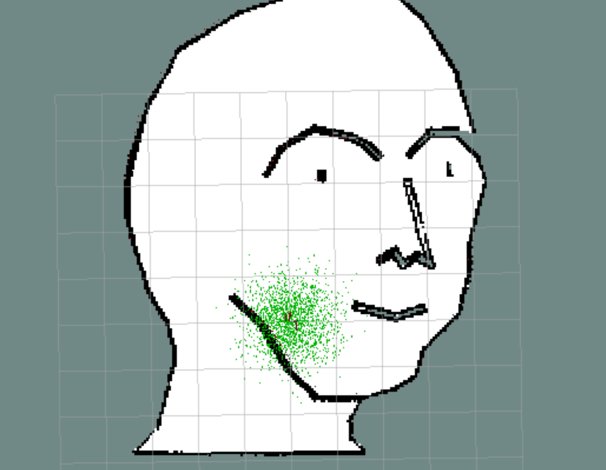
    </p>
</p>

Play with AMCL parameters, Change `yaml` file in `amcl.launch.py`

```python
# Get the launch directory
pkg_path = get_package_share_directory('neuronbot2_amcl')
# param_file_path = os.path.join(pkg_path, 'param', 'amcl.yaml')
# param_file_path = os.path.join(pkg_path, 'param', 'amcl_change_particle.yaml')
param_file_path = os.path.join(pkg_path, 'param', 'amcl_laser_range.yaml')    
```

* AMCL utils

Set initialpose

```bash
$ ros2 run neuronbot2_amcl initial_pose_pub.py
> X position : 0.0
> Y position : 0.0
> Yaw Orientation : 1.0
[INFO] [initial_pose_pub_node]: Publishing Initial Position
            X: 0.0
            Y: 0.0
            W: 1.0
```

If you stucked by format Err...

```bash
cd ~/neuronbot2_eloquent_ws/src/neuronbot2/neuronbot2_lecture/neuronbot2_amcl/scripts
chmod +x *

sudo apt install dos2unix
dos2unix initial_pose_pub.py
dos2unix set_param.py

cd ~/neuronbot2_eloquent_ws
cbp neuronbot2_amcl && roseloq
```

Edit AMCL Params

```
$ ros2 run neuronbot2_amcl set_param.py
```

Reinitialize localization results

<p>
    <p align="center">
        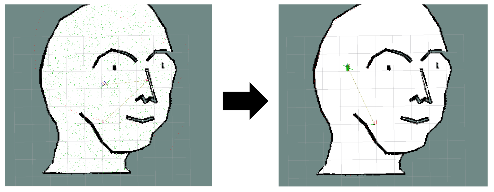
    </p>
</p>

```
$ ros2 service call /reinitialize_global_localization std_srvs/srv/Empty
```

* Real Robot AMCL

```bash
# Wake robot up, Sensor up ETC...
ros2 launch neuronbot2_bringup bringup_launch.py

# AMCL is intergrated with Nav2 launch (Because of nav2 lifecycle)
ros2 launch neuronbot2_nav bringup_launch.py map:=<full_path_to_your_map_name.yaml> open_rviz:=true

# Robot control with teleop
ros2 run teleop_twist_keyboard teleop_twist_keyboard
```

### Navigation - Path Planning

* neuronbot2 path planning

```bash
# Gazebo Env lauch
ros2 launch neuronbot2_gazebo neuronbot2_world.launch.py world_model:=mememan_world.model

# Nav2 brinup with prepared 2D map
ros2 launch neuronbot2_nav bringup_launch.py open_rviz:=true
```

<p>
    <p align="center">
        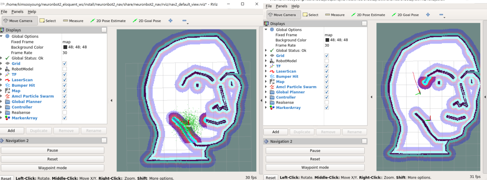
    </p>
</p>

* Play with `Navfn` Parameters

```bash
# build example package
cbp nav2_maze_pkg && roseloq

# Launch example gazebo world.
ros2 launch nav2_maze_pkg maze_gazebo.launch.py

# Nav2 bringup with prepared 2D map
ros2 launch nav2_maze_pkg bringup_launch.py open_rviz:=true
```

<p>
    <p align="center">
        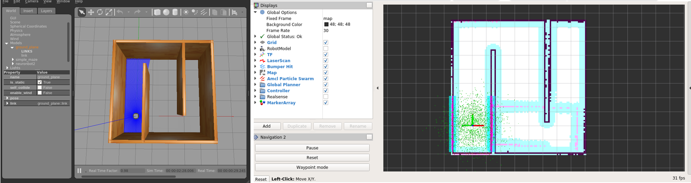
    </p>
</p>

If there's an Gazebo Err (especially about memory related errs)

```bash
source /usr/share/gazebo/setup.sh
```

Play with `Navfn` paramters

Edit `bringup_launch.py` file in `nav2_maze_pkg`.
change yaml file belows.

```python 
my_param_dir = os.path.join(my_nav_dir, 'param')
# my_param_file = 'neuronbot_params.yaml'
# my_param_file = 'neuronbot_params_astart.yaml'
# my_param_file = 'neuronbot_params_tolerance.yaml'
# my_param_file = 'neuronbot_straight_planner.yaml'
# my_param_file = 'neuronbot_pure_pursuit.yaml'
```

```yaml
planner_server:
  ros__parameters:
    use_sim_time: False
    tolerance: 0.5
    use_astar: true
```

* Custom Planner Plugin - referenced from [nav2 docs](https://navigation.ros.org/plugin_tutorials/docs/writing_new_nav2planner_plugin.html)

Let's make simple Custom Planner Plugin, Straight Line Planner!
Actual Plugin codes are in other package.

```bash
cd ~/neuronbot2_eloquent_ws/src
git clone https://github.com/kimsooyoung/navigation2_tutorials.git

# Compile new plugin and let ROS to recognize it.
cd ~/neuronbot2_eloquent_ws
cbp nav2_straightline_planner && roseloq
```

Custom planner plugin usage

```yaml
planner_server:
  ros__parameters:
    planner_plugin_types: ["nav2_straightline_planner/StraightLine"]
    planner_plugin_ids: ["GridBased"]
    use_sim_time: False
    GridBased:
      interpolation_resolution: 0.1
```

* Path Planning Utils

goal pose publish

```bash
$ ros2 run neuronbot2_path_planning goal_pose_pub.py
X Pos : 2.2
Y Pos : 0.0
W Quat : 1.0
[INFO] [goal_pose_pub_node]: Publishing  Goal Position
X= 2.2
Y= 0.0
W= 1.0
```

If you got format Err. 

```bash
cbp custom_interfaces && roseloq
cbp custom_nav2_bt_navigator && roseloq
cbp neuronbot2_path_planning && roseloq

cd ~/neuronbot2_eloquent_ws/src/neuronbot2/neuronbot2_lecture/neuronbot2_path_planning/scripts
chmod +x *

sudo apt install dos2unix
dos2unix goal_pose_pub.py

cd ~/neuronbot2_eloquent_ws
cbp neuronbot2_path_planning && roseloq
```

* Custom BT Navigator

Eloquent version BT Navigator doesn't have enough usability. So I customized it. 

```bash
# Build it
cbp custom_interfaces && roseloq
cbp custom_nav2_bt_navigator && roseloq
cbp nav2_maze_pkg && roseloq

# launch nav2 lifecycle nodes with new BT navigator
ros2 launch nav2_maze_pkg custom_bringup_launch.py open_rviz:=true
```

* Goal Action Client

Get Euclidian distance to Goal points

```
$ ros2 run neuronbot2_path_planning nav_to_pose_action_client.py
Distance from Goal: 1.0264804363250732
Distance from Goal: 1.0264804363250732
Distance from Goal: 1.0265885591506958
Distance from Goal: 1.0265885591506958
Distance from Goal: 1.0265885591506958
Distance from Goal: 1.0266036987304688
Distance from Goal: 1.0266036987304688
...
```

* Waypoint Follower 

Make robot to follow pre-defined points 

```
$ ros2 run neuronbot2_path_planning waypoint_follower_demo.py
[INFO] [Waypoint_Action_Client]: Current Waypoint : 0
[INFO] [Waypoint_Action_Client]: Current Waypoint : 0
[INFO] [Waypoint_Action_Client]: Current Waypoint : 1
[INFO] [Waypoint_Action_Client]: Current Waypoint : 1
[INFO] [Waypoint_Action_Client]: Current Waypoint : 1
...
```

## Day 5
---

### Navigation - Obstable Avoidance

------------------------------------------------------------

```
ros2 launch neuronbot2_lecture spot.launch.py
```

```
ros2 run tf2_tools view_frames
```

```
cbp custom_interfaces
cbp custom_nav2_bt_navigator
```

```
sudo apt install ros-eloquent-launch-testing-ament-cmake \
                ros-eloquent-geographic-msgs \
                ros-eloquent-diagnostic-updater \
                ros-eloquent-diagnostic-msgs -y

cd ~/neuronbot2_eloquent_ws/src
git clone -b eloquent-devel https://github.com/Adlink-ROS/robot_localization.git
cd ~/neuronbot2_eloquent_ws
cba
```

```
ros2 launch neuronbot2_gazebo neuronbot2_world.launch.py
ros2 launch neuronbot2_sensor_fusion robot_localization.launch.py
ros2 run teleop_twist_keyboard teleop_twist_keyboard
```

# AMCL
```
ros2 launch neuronbot2_gazebo neuronbot2_world.launch.py world_model:=mememan_world.model

ros2 launch neuronbot2_amcl amcl.launch.py
ros2 run teleop_twist_keyboard teleop_twist_keyboard
```

# nav2
```
ros2 launch neuronbot2_gazebo neuronbot2_world.launch.py world_model:=mememan_world.model
ros2 launch neuronbot2_path_planning bringup_launch.py open_rviz:=true

```

# Custom bt navigator

```
ros2 launch neuronbot2_gazebo neuronbot2_world.launch.py world_model:=mememan_world.model
ros2 launch neuronbot2_path_planning custom_bringup_launch.py open_rviz:=true
ros2 topic echo /goal_status
```

# My mannual Conflict
